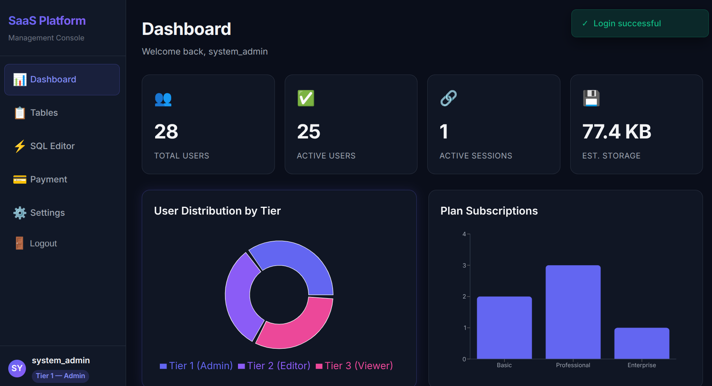
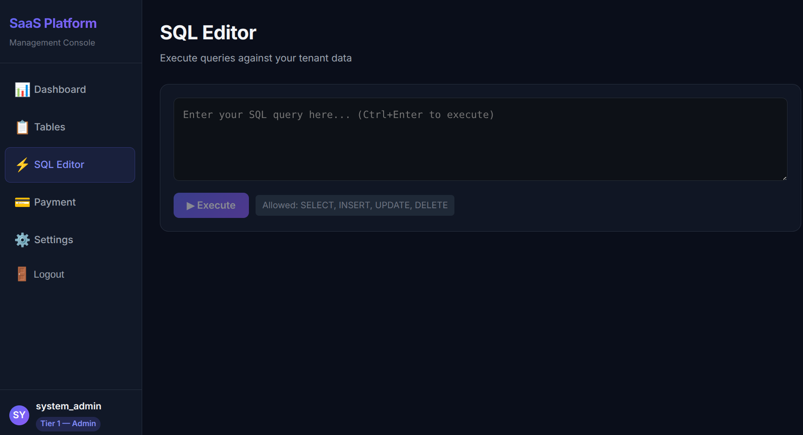
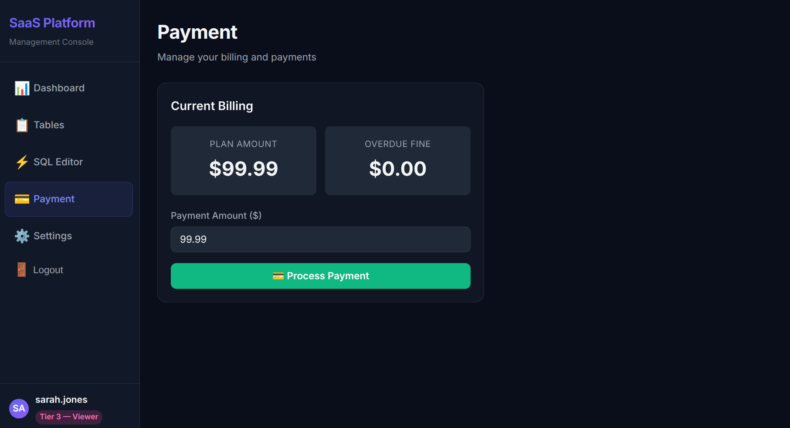

# B2B SaaS Platform

## 1. Project Overview
This application is a **B2B Software-as-a-Service (SaaS) Platform** designed for tenant management, subscription billing, and robust data administration. It targets SaaS providers who need to manage multiple corporate clients (tenants), handling their organization structures, subscriptions, role-based access control, and invoicing seamlessly. 

The primary problem it solves is **secure multi-tenant data isolation** combined with a full billing system. Tenants can write raw SQL queries safely against their data via an in-app SQL Editor that validates and restricts access based on their exact user tier and tenant ID.

**Team Members:**
- Abdul Hanan CH (BSCS24001)
- Muhammad Tahir Ahmed (BSCS24151) 
**Group Number:** 
- 9

---

## 2. Tech Stack
- **Frontend Framework:** React (with Vite)
- **Frontend Libraries:** React Router DOM (navigation), Recharts (data visualization)
- **Backend Framework:** Node.js with Express.js
- **Database:** MySQL 8.0.45 (InnoDB Engine)
- **Authentication:** Custom Session-based Auth (`UserSession` table mapping to `x-session-id` headers)
- **Security & Cryptography:** `bcrypt` (password hashing), `crypto` (OTP HMAC generation), `express-rate-limit`, `cors`, `helmet`.
- **Third-Party Libraries:** 
  - `pdfkit` and `exceljs` (for exporting query results to PDF/Excel)
  - `node-sql-parser` (for verifying user-provided SQL queries in the SQL Editor)
  - `axios` (Frontend API requests)

---

## 3. System Architecture
The application follows a traditional Three-Tier Architecture:
1. **Presentation Layer (Frontend):** A React Single-Page Application (SPA) that serves dynamic user interfaces based on their authentication status and tier level.
2. **Application Layer (Backend):** An Express REST API that handles business logic, rate limiting, schema validation, OTP verification, and SQL parsing. The backend acts as a strict gateway.
3. **Data Layer (Database):** A centralized MySQL database containing both system-level data and tenant data. 

**Interaction Flow:**
The Frontend sends HTTP requests equipped with an `x-session-id` header to the Backend. The Backend validates the session against the `UserSession` table, extracts the tenant (`client_id`) and permissions (`tier_level`), and executes parameterized queries using the `withTransaction` database wrapper. The Backend enforces tenant isolation dynamically by appending WHERE clauses or blocking unauthorized queries before they reach MySQL.

---

## 4. UI Examples

### Important Pages

1. **Dashboard**  
     
   *Purpose:* Provides visual analytics of active users, total storage consumed, and invoice statuses. Essential for tenant administrators to monitor their organization's health at a glance.

2. **SQL Editor**  
     
   *Purpose:* The core administrative tool allowing advanced users to write raw SQL queries to manipulate their specific data. Required for complex filtering, reporting, and bulk data modifications.

3. **Payment & Invoices**  
     
   *Purpose:* Displays historically paid invoices and pending dues. Users can simulate paying an invoice. Required for the SaaS revenue tracking flow.

---

## 5. Setup & Installation

### Prerequisites
- Node.js (v18 or higher recommended)
- MySQL (v8.0 or higher)

### Installation
Clone the repository, then install dependencies for both ends:

```bash
git clone <repository-url>
cd <path_to_SaaS_on_SaaS>
```

**(1) Backend Setup**
```bash
cd backend
npm install
```

**(2) Frontend Setup**
```bash
cd ..
cd frontend
npm install
cd ..
```

### Environment Configuration
Copy the `config.env.example` in the backend directory to `config.env` and populate it:

```ini
DB_HOST=localhost                       # Database host
DB_USER=your_username                   # MySQL Database user
DB_PASSWORD=your_password               # MySQL Database password
DB_NAME=saas_db                         # Database name (default: saas_db)
PORT=3000                               # API Port
HASH_SECRET=super_long_random_string    # Secret key for OTP generation
OTP_VALIDITY=30                         # OTP Validity in seconds
```

Copy the `config.env.example` in frontend directory to `.env` and populate it:
```ini
VITE_API_URL=http://localhost:3000/api/v1 # API URL
VITE_BLOOM_SIZE=1000000 # Bloom filter size approximately max number of users
```

Copy the `config.json.example` in the root directory to `config.json` and populate it:
```ini
{
  "system_user": {
    "username": "system_admin",  # System admin username
    "email": "admin@saasplatform.com", # System admin email
    "password": "system_admin" # System admin password
  },
  "plans": [ # System plans configuration
    {
      "plan_name": "Basic", #plan name (unique)
      "tier_1_users": 21, # max tier 1 users
      "tier_2_users": 22, # max tier 2 users
      "tier_3_users": 25, # max tier 3 users
      "monthly_price": 49.99, # monthly price
      "description": "Entry-level plan for small businesses" # plan description
    },
    {
      "plan_name": "Professional", #plan name (unique)
      "tier_1_users": 25, # max tier 1 users
      "tier_2_users": 20, # max tier 2 users
      "tier_3_users": 20, # max tier 3 users
      "monthly_price": 99.99, # monthly price
      "description": "Mid-tier plan with more features" # plan description
    },
    {
      "plan_name": "Enterprise", #plan name (unique)
      "tier_1_users": 100, # max tier 1 users
      "tier_2_users": 50, # max tier 2 users
      "tier_3_users": 25, # max tier 3 users
      "monthly_price": 299.99, # monthly price
      "description": "Full-featured plan for large organizations" # plan description
    }
  ]
}
```

### Database Initialization
Connect to your local MySQL instance to create the database and seed it:


```bash
# (If using linux)
sudo mysql
ALTER USER 'root'@'localhost' IDENTIFIED WITH mysql_native_password BY 'your_password';
FLUSH PRIVILEGES;
exit;
# ----------------

cd backend
node initDb.js <your_password> # your mysql password

# If wanna populate data (optional)
mysql -u root -p <your_password> # your mysql password
use <db_name>; # your db name in backend/config.env
source <path_to_seed.sql>; # absolute path to databse/seed.sql file
```


### Starting the Servers
**Start Backend:**
```bash
node backend/server.js
```
*Runs on `http://localhost:3000`* (or the port mentioned in)

**Start Frontend** (in a new terminal):
```bash
cd frontend
npm run dev
```
*Runs on `http://localhost:5173` (or the port defined by Vite)*

---

## 6. User Roles
The system implements strict Role-Based Access Control (RBAC) defined by `tier_level`. All non-system users are restricted to viewing and modifying only their specific `client_id` data.

1. **System Admin (`client_id=1`):** Complete cross-tenant visibility. Views all companies, global statistics, and can mutate plans globally.
   - *Test Credential:* your system admin username and password in config.json
2. **Tier 1 (Admin/Manager):** Can perform `SELECT`, `INSERT`, `UPDATE`, `DELETE` (all) operations on all tables related to their tenant.
   - *Test Credential:* Username: `diana.miller` | Password: `system_admin`
3. **Tier 2 (Editor):** Can perform `SELECT` and `UPDATE`. Blocked from creating or deleting records via the SQL editor.
   - *Test Credential:* Username: `bob.wilson` | Password: `system_admin`
4. **Tier 3 (Viewer):** Read-only mode. Can only perform `SELECT` operations.
   - *Test Credential:* Username: `john.doe` | Password: `system_admin`

---

## 7. Feature Walkthrough
- **User Authentication (Signup/Login/OTP):** Secure entry point. Signup requires OTP validation for both tenant and system admins and companies, uses Bloom filtering to find out available username without delays. Includes automatic rate-limiting and active session limits. Login has rate limiting to prevent brute force attacks.
- **Dashboard:** Generates live metrics by checking `ClientUserStats` and table row counts dynamically mapped to the user.
- **Data Tables View:** A structured GUI for non-technical users to browse schema layouts, constraints, and raw table data.
- **SQL Editor:** A secure playground for SQL queries. The backend parses raw SQL text via AST, automatically injects tenant isolation conditions, rejects DDL/GRANT queries, and executes the query safely. Results can be exported as Excel/PDF.
- **Export Data:** Users can export data from the Data Tables View to Excel/PDF file.
- **Billing & Invoicing:** Automated background triggers evaluate subscription renewals and generate upcoming invoices. Unpaid invoices block SQL Editor access by flagging `canAccessEditor` to `false` during login and payment grants the success again.
- **Account Settings:** Enables secure password updates validated against current hashed passwords once in a week.

---

## 8. Transaction Scenarios

1. **Signup Workflow (`backend/controllers/authentication.js`)**
   - *Trigger:* A new company registers via the frontend.
   - *Atomic Bundle:* Checks for duplicate emails. Verify OTPs. Inserts a new `Client` ->  Inserts `Subscription` -> Inserts 3 `Plan` configurations -> Hashes password -> Inserts root `User` admin.
   - *Rollback:* If any step fails (e.g. constraints fail or duplicate email occurs midway), everything aborts, leaving no orphaned clients.

2. **User Login (`backend/controllers/authentication.js`)**
   - *Trigger:* User submits login credentials. 
   - *Atomic Bundle:* Checks passwords -> Reads previous invoices using `FOR UPDATE` (row lock) to prevent race conditions during billing cycle -> Inserts overdue penalties or new repeating invoices -> Inserts new `UserSession`.
   - *Rollback:* Aborts if user is inactive, credentials mismatch, or database connection is disrupted.

3. **Processing Payments (`backend/controllers/payment.js`)**
   - *Trigger:* User pays an invoice on the Payment page.
   - *Atomic Bundle:* Validates invoice exists via `FOR UPDATE` -> Deducts balance -> Inserts `Payment` record -> Triggers automatically update `Invoice` status to "Paid".
   - *Rollback:* Aborts if the payment amount violates positive balance limits or invoice is already fully paid.

4. **Raw SQL Execution (`backend/controllers/sqlEditor.js`)**
   - *Trigger:* User executes a raw query from the SQL Editor.
   - *Atomic Bundle:* User queries are nested inside `BEGIN` / `COMMIT`. If the user attempts an illicit modification, an error occurs and it rolls back.

---

## 9. ACID Compliance

| Property | Implementation Detail |
|---|---|
| **Atomicity** | Implemented using a bespoke `withTransaction` wrapper in `backend/models/db.js` which executes `BEGIN` and ensures a `ROLLBACK` is issued if any JavaScript exception is thrown during the callback closure. |
| **Consistency** | Enforced heavily via MySQL schema triggers (e.g. `tr_subscription_plan_check`, `apply_overdue_penalty`) and standard table constraints (`FOREIGN KEY CASCADE`, `CHECK (monthly_price >= 0)`). Queries leaving the DB inconsistent are rejected natively. |
| **Isolation** | Defined explicitly per business need. Login and Payment operations use `FOR UPDATE` row locks. Signup uses `ISOLATION LEVEL SERIALIZABLE`. Analytics reads use `READ COMMITTED` to prevent locking tables across the tenant. |
| **Durability** | Handled natively by the InnoDB MySQL storage engine, guaranteeing committed invoices and payments are permanently persisted to disk. |

---

## 10. Indexing & Performance

**Key Indexes Created:** (Before - After, time)
- `idx_plan_client (client_id, plan_id)`: Reduces query time significantly when checking for active plans during plan statistics. (-573 µs)
- `idx_customer_client (client_id, customer_id)`: Reduces query time significantly when checking for active customers during user queries. (-186 µs)
- `idx_user (username)`: Reduces query time significantly when checking for username and password during login. (-149 µs)
- `idx_subscription_client (client_id, subscription_id)`: Reduces query time significantly when checking for active subscriptions during subscription statistics. (-24 µs, )
- `idx_subscription_customer (client_id, customer_id)`: Reduces query time significantly when checking for active subscriptions for a user during subscription statistics. (-133 µs)
- `idx_subscription_plan (client_id, plan_id)`: Reduces query time significantly when checking for active subscriptions for a plan during subscription statistics. (-225 µs)
- `idx_invoice_subscription (subscription_id, status, invoice_date)`: Reduces query time significantly when checking for latest paid invoice during invoice generation. (+247)
- `idx_invoice_dates (status, due_date, subscription_id)`: Reduces query time significantly when checking for pending invoice during overdue generation. (-45 µs)
- `idx_payment_date (payment_date)`: Reduces query time significantly when checking for timely revenue. (+99 µs)
- `idx_penalty_applied (invoice_id, applied, created_at)`: Reduces query time significantly when checking overdue charges during payment. (-53 µs)
- `idx_penalty_date (penalty_date)`: Reduces query time significantly when checking unpaid overdue. (+39 µs)

**Performance Impact:** 
Querying open invoices without indexing resulted in complete vertical table scans in InnoDB. Applying `idx_invoice_dates` dropped execution latency and row scans to `<1ms` for standard subset fetches.

---

## 11. API Reference

*Note: Auth-required routes expect the `x-session-id` header.*

| Method | Route | Auth Needed | Purpose |
|---|---|---|---|
| `POST` | `/api/v1/signup` | No | Register new tenant and initialize plans |
| `POST` | `/api/v1/login` | No | Authenticate user and issue session ID |
| `POST` | `/api/v1/signup/request-otp` | No | Send OTP emails to company and admin |
| `POST` | `/api/v1/logout` | Yes | Invalidate the current active session |
| `POST` | `/api/v1/change-password` | Yes | Update authenticated user's password |
| `GET`  | `/api/v1/tables` | Yes | Fetch full schema layout and table data mapping |
| `GET`  | `/api/v1/statics`| Yes | Fetch global dashboard analytics (users, storage) |
| `POST` | `/api/v1/query` | Yes | Securely parse and execute raw SQL statements |
| `POST` | `/api/v1/exportData` | Yes | Export queried SQL data to `.pdf` or `.xlsx` |
| `GET`  | `/api/v1/pay` | Yes | List tenant's past payments and invoices |
| `POST` | `/api/v1/pay` | Yes | Simulate paying an invoice |

---

## 12. Known Issues & Limitations
1. **In-Memory Rate Limiter Reset:** The current setup utilizes `express-rate-limit` relying on RAM. It resets if the server restarts and cannot distribute limits across multi-cluster deployments.
2. **Limited Error Recovery Form UI:** For signup validation, if a single `CHECK` constraint fails mid-way, the GUI toast presents a generic internal error instead of dynamically mapping to the specific field that violated it.
3. **Node parser for SQL is not robust** - It is a simple parser that can be fooled easily for malicious queries.
4. **No GMAIL FOR OTP** - OTP is just displayed on server but not sent on actual provided GMAIL.
